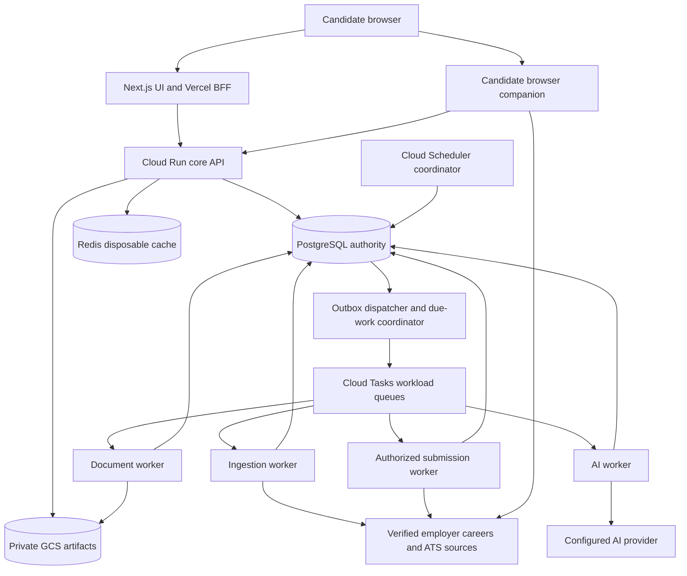

# HireWiz employer discovery and application system design

Status: Proposed for product and engineering review; not implemented or deployed.

Prepared: 7 October 2026. Current-state audit: repository `d5c2ea8` and read-only production inspection on that date. Provider contracts must be rechecked before integration release.

Decision update, 8 October 2026: Retain the existing GCP hosting and current core deployment region for this development workflow. AWS, Azure, Kubernetes and regional/database migration are deferred. Implement required feature foundations within the existing deployment approach; the regional alternatives below remain future options, not initial delivery prerequisites.

AI efficiency decision, 8 October 2026: Deterministic processing and result reuse are the default. Generative analysis is optional where it improves interpretation/writing; discovery, basic fit, original/custom selection, confirmed-answer filling, supported submission and receipts must work without an LLM. The [AI call efficiency audit](AI_CALL_EFFICIENCY_AUDIT.md) records current call paths, replacements, limits and acceptance tests.

This extends the Career Workspace architecture with employer-origin job discovery, explainable matching, resume preparation, candidate-controlled form filling and supported submission. India-first, English-language adult candidates are the working pilot assumption; the job model supports international expansion. The initial country scope remains a product decision.

The recommendation is to retain the Next.js/Vercel frontend and FastAPI modular backend, use one PostgreSQL transactional authority, and separate ingestion, AI, document processing and submission into independently limited worker runtimes. Build coverage around verified employer sources and actual permissions. Scale from measurements and bounded admission rather than increasing every autoscaling limit together.

## 1. Product contract and scope

The candidate uploads a resume, confirms extracted facts and chooses desired roles, locations, experience level and work preferences. HireWiz searches its fresh index of verified employer postings, explains suitable roles and lets the candidate select jobs. Each job independently offers the original resume, a reviewed tailored version or a custom upload. Generating a tailored draft does not change the chosen attachment or authorize disclosure.

The candidate reviews the exact file, answers, employer consent and destination. Approval can cover multiple prepared applications, but each job has an immutable approved package and permitted actions. Supported connectors fill or submit those packages; unsupported sites receive a guided handoff. The workspace distinguishes verified submission, user-reported submission and an unconfirmed outcome.

| Promise | Implementation boundary |
| --- | --- |
| Employer-origin jobs | Employer careers pages, employer-controlled ATS boards or employer-authorized feeds; traceable employer-to-source relationship |
| Recent, relevant jobs | Measured freshness and eligible-source coverage; original publication, republication and first-seen times kept separate |
| Candidate control | Per-job resume choice before and after tailoring, exact artifact preview, explicit answer/consent decisions, bounded batch approval |
| Professional resume output | Preserve source layout by default; verify readability and destination limits; offer a separately reviewed simpler layout when needed |
| Automatic applications | Available only where connector capability, employer/platform permission, complete form data and candidate approval all allow it |
| Reliable tracking | Mark confirmed only with a valid receipt; expose uncertainty and handoffs |

Universal internet coverage, access to every ATS tenant, guaranteed employer parsing, guaranteed selection and universal unattended submission are outside the promise. Existing TheirStack/Adzuna/Jooble market integrations do not supply the new origin-only pipeline.

## 2. Verified baseline and work required before expansion

The current runtime description remains in [ARCHITECTURE.md](ARCHITECTURE.md). The following snapshot records observed configuration, rather than intended runbook settings. Live identifiers and secrets are intentionally omitted.

| Component | Observed current state | Consequence |
| --- | --- | --- |
| Frontend | Next.js 16/React 19 on Vercel; server BFF; no function region configured in repository | Keep token boundary; verify and align BFF region |
| API | Cloud Run `us-central1`, 1 vCPU/1 GiB, concurrency 10, timeout 300 seconds; active revision max 1, service max 3 | Current revision has little horizontal headroom; measure before raising limits |
| Analysis worker | Private Cloud Run, same region/resources, concurrency 4, timeout 300 seconds; active revision max 5, service max 20 | Separate from API already; future workloads need their own budgets |
| Database | Neon PostgreSQL 17.11 on AWS Singapore, direct endpoint; server reports `max_connections=901` | Cross-cloud/cross-region path; reported ceiling is not tested throughput or a safe connection budget |
| Cache | Redis Cloud configured for API; region unverified; no Redis URL on worker | Do not assume shared worker limits or co-location exist |
| Queue | Cloud Tasks: 5 dispatches/second, 10 concurrent, five queue attempts, 10–300-second backoff; worker also caps retryable attempts at three | Actual throughput depends on job duration; this retry contract must not be copied to external submission |
| Scheduling | No Cloud Scheduler jobs found in inspected `us-central1` | Planned maintenance schedules need provisioning and verification |
| Artifacts | Original bytes in PostgreSQL; versions store edits and render exports on download | Introduce private immutable object storage and seal approved bytes |
| Release | Latest revisions receive all traffic; API startup runs migrations | Introduce controlled migrations and staged releases |

The API is publicly invokable at Cloud Run IAM and checks application JWTs; the worker has private IAM. Do not describe the present API as IAM-private. Minimum scaling is unset for both inspected services. Service and revision limits are distinct; neither observed configuration proves regional failover or backup readiness.

The immediate engineering prerequisites are:

1. Move migrations into one controlled release job using a direct database connection. Current session advisory locks are incompatible with assuming transaction-pooler session affinity.
2. Configure bounded runtime connection pools and move network/model/rendering work outside database transactions. Current tailoring holds a resume row lock across expensive processing.
3. Put upload parsing, native document work and model calls into durable background jobs. Current async upload route performs synchronous processing.
4. Add a PostgreSQL transactional outbox and repair sweeper. Current analysis creation commits before queue dispatch, leaving a crash window.
5. Freeze reviewed exports as immutable bytes plus SHA-256. Rendering a version again after approval can produce a different file.
6. Replace process-local rate limits with distributed admission and record actual model attempts, returned token usage and successful fallback model. Current approximate telemetry cannot establish spend control.

These are identified implementation seams, not fixes completed by this document. Relevant code: [database](../backend/app/database.py), [startup](../backend/entrypoint.sh), [upload](../backend/app/routers/resume.py), [analysis operations](../backend/app/domains/analysis/operations.py), [dispatch](../backend/app/domains/analysis/service.py), [rate limiting](../backend/app/rate_limiter.py), [artifact ownership ADR](adr/006-data-and-artifact-ownership.md).

## 3. Target topology and system boundaries

The database-to-dispatcher arrow represents polling committed outbox/due-work records, not an automatic database push. The diagram shows proposed execution roles; the pilot may combine low-volume maintenance/notification coordination in one runtime.

Keep identity, candidate facts, career workspace, approval, usage and application state in the modular backend with clear service interfaces. Use the same repository and shared domain contracts; deploy separate entrypoints/images where permissions, dependencies or resource profiles differ. Document/browser tooling should not enlarge the API image unnecessarily. A native processor cannot access employer submission credentials.

This preserves atomic authorization/accounting changes and small-team operability. The trade-off is shared database capacity and release coordination. Extract a domain into a separate service only when independent ownership, security isolation or sustained contention requires it; separate worker processes already provide useful scaling isolation.

## 4. Chosen services and trade-offs

| Concern | Proposed choice | Why and trade-off | Change trigger |
| --- | --- | --- | --- |
| Web/UI | Existing Next.js, React, Tailwind, Vercel | Retains design and BFF session boundary; adds a backend hop | Measure BFF latency; relocate its server processing before changing platforms |
| Core/backend workers | FastAPI/Pydantic on Cloud Run | Existing team stack, managed autoscaling, per-role identities; cold starts and instance/connection control need attention | Keep minimum API capacity when SLO requires it; split a domain when justified |
| Transactional database | Retain Neon PostgreSQL for pilot, bounded pooled runtime connections | Avoid migration risk; cross-cloud networking and plan-specific capacity/restore constraints remain | Residency, measured latency, private networking or operational/HA needs justify co-located Cloud SQL PostgreSQL regional HA |
| Files/receipts | Private Google Cloud Storage | Large immutable artifacts no longer bloat operational DB; object and DB writes are not one transaction | Lifecycle, orphan reconciliation and deletion outbox required from first release |
| Commands | Cloud Tasks + PostgreSQL outbox | Directed work, scheduling, rate limits; delivery can repeat | Additional independent event consumers justify Pub/Sub for fact fanout |
| Scheduled discovery | Cloud Scheduler coordinator + PostgreSQL due-source leases | One small coordinator schedules bounded source work; no cron per employer | Shard coordinators by source hash when coordination itself becomes a bottleneck |
| Cache/admission coordination | Existing Redis Cloud, with region and failure policy verified | Lower migration effort; disposable cache only; global limit failure must be handled | Private networking/HA economics justify regional Memorystore |
| Retrieval | PostgreSQL filters, GIN full-text search, optional trigram | Small operational surface, transactional job index; limited search-specific scaling | Add pgvector only for demonstrated relevance gain; external search when indexed query load remains over SLO after tuning |
| AI | Existing provider abstraction, supported benchmarked Gemini models; regional enterprise endpoint when required | Reuses integration; quotas, quality, retention and residency need explicit configuration | Provider/model changes only after evaluation and data-processing review |
| Secrets/identity | GCP Secret Manager, separate service accounts, workload federation | Tenant-scoped secrets and short-lived infrastructure credentials; grant management adds work | Employer onboarding increases need for credential rotation tooling |
| Browser assistance | Chrome MV3 companion first | Candidate retains login/session; device availability and portal changes limit unattended work | A permitted server browser requires its own isolated runtime and tested connector |
| Infrastructure/releases | Terraform, existing Cloud Build/Artifact Registry, GitHub Actions, Vercel staged production | Repeatable environments and immutable releases; adds initial setup effort | More cells reuse modules rather than manual copies |
| Observability | OpenTelemetry, Cloud Logging/Monitoring, application audit ledger | Correlates cross-service work; careful redaction and cardinality controls needed | Warehouse analytics/Pub/Sub later when independent workloads justify them |

Cloud Tasks and Pub/Sub solve different invocation patterns; both require consumers to handle repeated delivery. We will use directed commands first and add event fanout only when needed. [Google queue comparison](https://docs.cloud.google.com/tasks/docs/comp-pub-sub)

Neon uses transaction-mode PgBouncer pooling; session-scoped features and migration tooling need direct connections. Its client connection capacity is not the database's simultaneously executable workload capacity. Pooler compatibility, timeouts and actual transaction load must be tested before rollout. [Neon pooling](https://neon.com/docs/connect/connection-pooling)

## 5. Geography, India and global expansion

The immediate recommendation is to benchmark a Singapore core deployment against the current US core, keeping the existing Neon Singapore database during the pilot. GCP `asia-southeast1` is geographically close to the current database; pin the Vercel BFF server region near the chosen core and measure end-to-end latency, egress and reliability. Move queues, regional object storage and appropriate cache placement together. Geographic proximity is a hypothesis to validate, not a measured latency result. [Cloud Run regions](https://docs.cloud.google.com/run/docs/locations), [Vercel function regions](https://vercel.com/docs/functions/configuring-functions/region)

If India-only storage/processing becomes a contractual requirement, choose an India cell, proposed as GCP Mumbai `asia-south1` with regional-HA Cloud SQL PostgreSQL, regional storage and suitably configured processors. Neon currently lists no India project region; moving a Neon project region requires a new project/migration. This is an architectural option, not a claim that every Indian candidate legally requires India-only processing. [Neon regions](https://neon.com/docs/introduction/regions), [Cloud SQL regional HA](https://docs.cloud.google.com/sql/docs/postgres/high-availability)

Residency must cover database, files, queues, cache, secrets, backups, logs, Vercel server functions, AI and optional notification processors. An employer application necessarily sends approved data to the identified employer/ATS; disclose that destination separately. Google documents that global model endpoints do not provide processing-location guarantees; regional commitments depend on the selected model/endpoint. Verify actual supported combinations rather than assuming that a regional database or endpoint name proves the whole system's residency. [Google model residency](https://docs.cloud.google.com/gemini-enterprise-agent-platform/resources/data-residency)

Start with one writable candidate home cell. Introduce EU/US/India cells when jurisdiction, latency, commercial commitments or workload isolation justify them. An account's home cell owns approvals, artifacts and submission authority. Public job catalogs can be replicated; candidate PII should not enter a global search index. Home-cell changes are deliberate migrations with outbound submission paused and state reconciled. Prefer zonal resilience and tested regional recovery before active-active writes.

Global job fields use ISO country/currency codes, original language, UTC timestamps with source timezone, normalized and original locations, remote/hybrid/on-site status, remote eligibility countries, employment type and source-specific values. “Remote” never automatically means “can work from India.” Unknown salary, location or eligibility stays unknown.

## 6. Employer registry and origin verification

There is no single public API for all employer jobs in India or globally. Build an expanding registry of verified employers and their actual recruiting sources, then crawl/index shared public postings once for all candidates.

Employer onboarding starts with curated companies for the pilot's roles, user-supplied official career URLs, direct employer onboarding and permitted partner feeds. Company directories can help identify names, but they do not establish job availability or ATS permissions. For example, exchange lists cover listed companies, excluding many private firms and startups. Search engines can help locate official career pages; aggregated job content is not imported into this origin-only index.

Verify the company's official domain, follow its careers link to the ATS board, bind the board/tenant to that employer, and retain verification evidence, method, date and recheck schedule. A familiar ATS hostname alone is insufficient. Validate redirect/DNS destinations and reject private/metadata addresses. Suspicious domain changes quarantine the source pending review.

`EmployerSource` stores employer ID, verified domain, provider, tenant/board ID, region, official career/application URLs, source method, terms/data-use decision, allowed operations, credential reference if any, grant expiry, health, connector version, polling cursor and next-fetch time. Candidate approval authorizes use of their data for a job; it does not supply an employer API key or platform integration permission.

## 7. Connector selection and actual platform access

Connectors are selected from the recruiting system detected on the employer's official careers page. They are versioned adapters with explicit capability declarations, not a general agent allowed to submit arbitrary web requests.

| Source | Discovery path | Application path and constraint | Priority |
| --- | --- | --- | --- |
| Greenhouse | Public Job Board GET for a verified employer board | Job Board POST requires employer credentials; validate mandatory fields ourselves | First-wave discovery; submission only after grant and full form tests |
| Lever | Public company Postings API; respect global/EU hosting | Employer-key application API has form limitations; verify custom questions before enabling | First-wave discovery and assisted forms |
| Ashby | Public verified board API; exclude `isListed=false` from general search | Authenticated submission/form APIs or approved partner access | First-wave discovery; evaluate complete API flow with an actual employer grant |
| SmartRecruiters | Public company Posting API | Protected Application API with appropriate scope; employer questions/consents and status contract | Next discovery adapter; submission pilot if access is secured |
| Workday | Employer careers pages or specifically authorized tenant integration | Secured recruiting APIs; no assumed anonymous cross-tenant application access | Guided handoff/limited tested assistance first |
| Employer-owned custom site | Permitted feed, structured JobPosting metadata, sitemap or tested page parser | Site-specific supported browser flow or documented authorized API | Add by actual demand and reliability |

Greenhouse's public board reads and authenticated application POST are distinct. Its integration partner route also has prerequisites; access is a commercial/onboarding dependency. Harvest v1/v2 sunset on 31 August 2026 concerns Harvest, not the separately documented Job Board API. Do not mistake a historical Harvest integration for current submission access. [Job Board API](https://docs.greenhouse.io/job-board.html), [partner process](https://www.greenhouse.com/uk/integration-partner), [API overview](https://support.greenhouse.io/hc/en-us/articles/10568627186203-Greenhouse-API-overview)

Lever's Postings API documents application rate limits and lacks support for every custom question. Its partner Data API OAuth route does not automatically replace a Postings application key or expose all customers. The initial adapter must compare actual required questions with supported submission fields; incomplete forms go to assisted/manual mode. [Postings API](https://github.com/lever/postings-api), [partner API](https://hire.lever.co/developer/partner)

Ashby's dedicated feeds include employers that opt into the partner, rather than every Ashby customer. Public `publishedAt` represents last publication. When using its submission API, set `allowSubmissionForUnpublishedJobPosting=false` explicitly and inspect application/form outcomes, including blocked messages, rather than treating HTTP 200 alone as acceptance. [Public boards](https://developers.ashbyhq.com/docs/public-job-posting-api), [partner feeds](https://developers.ashbyhq.com/docs/dedicated-partner-job-feeds), [submission contract](https://developers.ashbyhq.com/reference/applicationformsubmit)

SmartRecruiters' public postings and protected application APIs are separate. Application access uses the required candidate application scope and supports provider-defined questions/consents. Rate/concurrency and timeout policies differ between APIs and must come from the applicable contract. Marketplace job-board publications cover participating employer relationships. [Posting endpoints](https://developers.smartrecruiters.com/docs/endpoints), [Application API](https://developers.smartrecruiters.com/docs/application-api), [job-board partnerships](https://developers.smartrecruiters.com/docs/partners-job-board-api)

Workday exposes tenant-secured recruiting operations; their existence does not establish public candidate-bot access. Reverse-engineered careers endpoints are not a stable documented integration contract. Confirm each employer site's permission and supported path before automating. [Get Job Postings](https://community.workday.com/sites/default/files/file-hosting/productionapi/Recruiting/v47.0/Get_Job_Postings.html), [Put Candidate](https://community.workday.com/sites/default/files/file-hosting/productionapi/Recruiting/v47.0/Put_Candidate.html)

Choose the first submission integration using an actual willing employer/partner, completeness of form access, receipt/reconciliation support, permission scope and pilot-user demand. Do not choose it solely by an ATS brand's popularity. Partner approval lead time is separate from engineering effort.

The typed connector contract includes `discover`, `fetch_detail`, `get_form`, `validate_package`, `prepare`, `submit` and `reconcile`. Unsupported operations return explicit capability errors. Each adapter defines hosting regions, pagination, source date semantics, file limits, question mappings, documented rate scope, errors, idempotency and receipt evidence. Credentials are references to tenant-scoped secrets, never values returned to the frontend.

Effective capability is the intersection of adapter support, the access basis for that operation, current job/form readiness and candidate-approved mode where data is disclosed. Public discovery/preparation can use permitted public reads without an employer API enrollment. Filling requires applicable site permission and candidate approval; protected API submission also requires the employer/platform write grant. Display **Prepare**, **Assisted filling**, **Automatic submission available**, **Needs input**, or **Unsupported** for each job. A public discovery adapter never implies automatic submission.

## 8. Ingestion, freshness and coverage

Cloud Scheduler triggers a small coordinator. The coordinator leases due `EmployerSource` rows, admits a fair bounded slice, writes execution/outbox records and exits. Dispatch by workload/provider groups, with per-domain/tenant limits inside the dispatcher. Avoid a queue or Scheduler job for every employer; use a bounded queue set per cell, expanding only for materially different limits or blast radius.

Proposed initial polling is every 1–6 hours according to source size, change rate and allowed API policy. Honor partner feed cadence; do not poll an hourly-generated feed expecting minute-level updates. Use conditional requests where supported, incremental cursors and description hashes. Fetch details for changed records instead of repeatedly expanding every posting. Stagger work with jitter and maintain per-source health/backoff.

Store `original_posted_at`, `last_published_at`, `updated_at`, `first_seen_at`, `last_seen_at` and `last_successful_source_fetch_at` independently, with nulls where unknown. Do not display a republication/update as a new original listing. Hide known closed jobs, revalidate availability before disclosure/submission and display staleness during outages.

Only a complete successful listing scan can contribute absence evidence. A failed page, broken cursor, provider outage or malformed response cannot close an employer's whole catalog. Repeated absence/explicit closure follows connector-specific policy; keep historical job versions for saved opportunities. Deduplicate first by provider/tenant/posting ID and employer requisition ID. Similar text alone cannot safely merge different locations or openings; use uncertain duplicate groups without losing originals.

Coverage reports verified employer count, healthy sources, active jobs, last-checked age, location/role distribution and supported application modes. Report the covered population honestly; an ATS adapter supporting 1,000 employers does not mean we have discovered or been granted access to all of them. Broad India/global coverage is ongoing source acquisition and verification work, not a single connector task.

## 9. Retrieval, ranking and AI boundaries

Discovery searches the shared catalog. Normalize candidate choices while retaining explicit preferences and hard constraints. SQL filters remove known ineligible location, work authorization, experience or employment requirements; uncertain values remain visibly uncertain. Use full-text/skill/title retrieval, deterministic evidence coverage and template explanations as the default. Enhanced model interpretation is optional for useful ambiguity or requested coaching, rather than mandatory for a shortlist or detail-page visit.

Separate eligibility, preference fit, experience coverage and evidence confidence. A match score is a ranking aid, not a hiring probability. Explain strengths, missing requirements and uncertainty. Validate relevance using a labeled resume/job benchmark and candidate shortlist feedback before changing weights or adding embeddings.

AI interprets language, suggests related roles, extracts structured drafts, explains matches, proposes truthful wording and drafts suitable free-text answers. Deterministic services control source identity, permissions, constraints, bytes, fields, authorization, usage and submission. Job pages/resumes are untrusted prompt content; no model can choose credentials, recipient URLs or grant itself a submission capability. [OWASP prompt injection guidance](https://cheatsheetseries.owasp.org/cheatsheets/LLM_Prompt_Injection_Prevention_Cheat_Sheet.html)

Use supported versioned models selected by an evaluation gate. Cache public job normalization by job-content/schema/model hash; cache private analyses only within the candidate boundary using resume/evidence/preference/job/prompt/model versions. Sensitive declarations and unnecessary contact fields stay out of prompts. Structured JSON is validated for meaning, evidence references and unsupported claims. Record every actual provider/model attempt, returned usage, latency, fallback and cost rate version; label estimates when returned usage is unavailable.

Do not call a model separately for every globally indexed job for every user. Basic discovery/ranking performs zero generative calls. Bound optional top-K analyses, reuse shared normalization/results, coalesce identical requests and reserve usage before admitted billable work. No useful need for interpretation/writing means no model call. Matching, tailoring and submission billing remain separate; original/custom resume selection incurs no tailoring call. Pricing changes require product review, not an infrastructure assumption.

## 10. Files, readability and preservation

Use private GCS for originals, quarantined uploads, sealed exports and restricted receipt evidence. PostgreSQL stores ownership, object generation, SHA-256, MIME/type validation, byte size, source/version and processing state. Immutable unique object names and generation preconditions prevent accidental replacement. Signed access is short lived and recipient scoped through our authorization service; signed URLs are bearer access and must not enter public caches, logs or outbound job pages. [Object preconditions](https://docs.cloud.google.com/storage/docs/request-preconditions), [signed URL behaviour](https://docs.cloud.google.com/storage/docs/access-control/signed-urls)

Object storage and PostgreSQL are not atomically committed together. Upload to quarantine, scan/validate, compute hash, then finalize metadata. A sweeper removes orphaned objects; transactional deletion outbox and reference checks implement retention/account deletion. Candidate-private artifacts use separate ownership keys rather than cross-user content deduplication. Public job blobs can be content-addressed under a separate namespace.

Preserve original bytes for the agreed account retention period and let the candidate download them unchanged. Apply edits against source structure, keep unsupported edits explicit, and retain the original on any failure. PDF/DOCX are the first supported formats; a PDF created from LaTeX is still a PDF input. Native LaTeX editing requires source and a separately sandboxed compilation flow; do not reconstruct source from a PDF and call it exact preservation.

The current PDFium process lock means native PDF operations need measured process-level isolation. Start document workers with one concurrent native job, bounded file/page/time/memory limits, and only increase after stress testing. Preserve fonts, heading structure, links, reading order and acceptable pagination where feasible. Scan outputs for missing text, broken metrics, unreadable glyphs, clipping and destination type/size limits. A validated simpler ATS-oriented layout is an optional separate artifact, never a silent fallback.

Before approval, render/finalize the export once, seal the object, preview that same file and approve its hash. Submit those exact bytes. For DOCX, show a representative render and the native download; different editors can render it differently. Any conversion or new renderer output creates a new version requiring review. A checksum proves identity, not truthful content or universal employer parsing.

## 11. Authoritative records and consistency

| Record | Essential contract |
| --- | --- |
| `CareerPreferenceVersion`, `CandidateFact`, `SavedAnswer` | Candidate-owned, versioned, provenance, confirmation/expiry; evidence approval is distinct from external verification |
| `EmployerSource`, `ConnectorGrant` | Verified employer/tenant, permitted operations, secret reference, expiry, environment and health |
| `JobPosting`, `JobPostingVersion` | Canonical source identity, current searchable fields, immutable changed snapshots |
| `FormSchemaVersion` | Actual employer questions, conditional rules, attachments, consent text and schema digest |
| `ResumeArtifact` | Immutable bytes/hash/generation, owner, source and validation state |
| `ApplicationPackage` | Immutable job/form snapshot, selected artifact, answers/provenance, consent values, connector and content revision |
| `ApplicationAuthorization` | Actor, package digest, employer/job, allowed `fill`/`submit` actions, time, expiry and revocation |
| `ApplicationIntent` | Candidate/opening, approved package, state/revision, cancellation and active attempt |
| `ApplicationAttempt`, `SubmissionReceipt` | Executor, lease/fence, launch decision, request hash, provider idempotency if supported, classified outcome and proof |
| `DispatchOutbox`, `AuditEvent`, usage ledger | Durable event IDs/revisions, delivery state, append-only transitions and accounting |

Use names compatible with existing domains where practical; this is a proposed contract, not a migration schema. Link `Opportunity` to canonical job identity while retaining its historical job snapshot. A partial unique constraint prevents more than one active intent per candidate/canonical opening; an explicit reapplication is a separately approved generation. Validate ownership on every nested resource, not only top-level pages.

PostgreSQL transactions govern authorization, state transitions, accounting and receipt persistence. Public search/cache results can be eventually consistent; final readiness reads the authoritative job/form/approval state. A lagging replica cannot authorize submission. There is no distributed transaction across our database and an ATS.

Use indexed country/location/title/employer/date/state fields, GIN full-text indexes, keyset pagination and unique provider/tenant/posting keys. Keep provider-specific extras in schema-versioned JSONB, not unbounded columns. Isolate public job tables from candidate-private data in queries and permissions; a separate database/search index is a later measured option.

## 12. Queue durability, backpressure and fair scheduling

Create intent/run, usage reservation if applicable, audit event and outbox row in one short transaction. The dispatcher publishes committed rows using deterministic task identity, then records dispatch. A crash between publish and dispatch bookkeeping can repeat the wakeup; a database consumer guard makes it harmless. Sweeping undispatched records and stranded safe work closes lost-job windows. [Transactional outbox pattern](https://docs.aws.amazon.com/prescriptive-guidance/latest/cloud-design-patterns/transactional-outbox.html)

Cloud Tasks is a wakeup mechanism, not the authoritative business record. It can duplicate execution and does not guarantee ordering. Maintain business attempt/deadline budgets in PostgreSQL, and an application-owned failed-work table with operator retry tools. Do not describe this as a native Cloud Tasks dead-letter queue. HTTP task handlers have a maximum dispatch deadline; bounded backfills/long maintenance can use Cloud Run Jobs, while human waits persist state and release workers. [Task pitfalls](https://docs.cloud.google.com/tasks/docs/common-pitfalls), [task deadlines](https://docs.cloud.google.com/tasks/docs/dual-overview)

Use separate ingestion, AI, document and submission queues/worker limits. Apply provider/account/domain quotas, per-user active-work limits, daily application caps, document CPU limits and model budget admission. Database scheduling admits bounded slices of large batches with round-robin/aging fairness; queue order does not ensure fairness. Retries use bounded exponential backoff with jitter only for reads and mutations classified safe by the adapter. Honor provider throttling, add circuit breakers and show waiting reasons.

Redis can coordinate fast token buckets and cache results. Financial entitlements, approvals, attempts and receipts remain durable. If shared limiter state fails, degrade cached discovery and pause or use conservative durable admission for outbound submissions; do not allow unconstrained sending. Keep separate budgets for each credential scope and aggregate model quota across all workers.

API commands return `202` plus durable status promptly; UI polls or uses an authenticated status stream. Reject/defer new work with clear reasons before exhausting dependencies, while preserving previously accepted durable work. Never start an unbounded number of child jobs because a user selected every result.

## 13. External disclosure and submission state machine

The approval digest binds employer/ATS tenant/posting, material job requirements, actual form/consent, exact artifact hash, answers and permitted action. Exclude presentation-only formatting and volatile tracking timestamps from the digest. A material change invalidates only affected applications and displays what changed. Unrelated profile changes do not mutate frozen packages; evidence revocation affecting a prepared claim does require review.

Approval must precede external autofill/upload: page scripts can receive or autosave personal information before the final Submit button. A candidate can approve filling only, or approve filling and submission for exact packages. The product must communicate that distinction.

Before entering `FILLING` or disclosing/uploading a new field/file, atomically check current account state, authorization/digest, operation-specific access basis, cancellation and executor generation. Issue a short-lived recipient-bound disclosure permit; an old queued extension command is insufficient. Revalidate before final sending as a separate decision. Revocation or account deletion stops actions whose decision has not started; data already disclosed or an external operation already in flight cannot be recalled by revoking a permit.

| State | Behaviour |
| --- | --- |
| `DRAFT / PREPARING / NEEDS_INPUT` | No external disclosure; prepare and collect facts |
| `READY / APPROVED / QUEUED` | Exact package ready/authorized; pending cancellation can prevent final sending |
| `FILLING / FILLED` | Disclose only approved data to the bound recipient; final submission still requires its permitted action |
| `WAITING_USER` | Persist challenge/login/new-question state; no worker held while the candidate acts |
| `SUBMITTING` | Atomically validate approval/cancellation and consume a single launch authorization before POST/final click |
| `CONFIRMED` | Persist valid receipt, automated Applied status and notification event together |
| `REJECTED / FAILED_SAFE` | Documented rejection or evidence that no final mutation occurred; controlled retry may be allowed |
| `UNKNOWN` | Submission may have been accepted; block automatic replay and reconcile |
| `CANCELLED` | Final sending prevented before its launch decision; record any earlier disclosure |

Before sending, a short transaction compares intent revision, package digest, current capability and cancellation, stores the attempt and `SUBMITTING` marker, then commits. Perform the network operation without a held transaction. A result transaction validates attempt/fencing identity and records the outcome. An expired submitting lease becomes `UNKNOWN`, never automatically `QUEUED`.

Valid late receipts must remain ingestible after an execution lease expires or its executor is fenced. A separate narrow receipt-ingestion path authenticates the evidence source and binds proof to the immutable attempt, employer/job and request/package. It may resolve `UNKNOWN` to `CONFIRMED` and commit receipt/accounting idempotently; it does not grant a stale worker permission to send, change answers or resume execution. Conflicting/unmatched evidence is quarantined for reconciliation.

Fencing prevents stale workers from changing our database but cannot fence an external HTTP request already sent. Timeouts, worker crashes or 5xx responses after the final mutation starts can mean acceptance; classify them by provider contract. Without documented provider idempotency, internal IDs/leases do not provide end-to-end exactly-once submission. [Safe-retry design](https://aws.amazon.com/builders-library/making-retries-safe-with-idempotent-APIs/)

Cancellation competes with the launch decision under the same row/revision control. If cancellation wins, sending is prevented. If launch wins, show that sending may be in progress; a later valid receipt is confirmed with `cancel_requested=true`, not hidden behind a false cancelled label. Queue deletion alone is insufficient. Withdrawal after acceptance is a separate supported action.

Reconciliation uses an authorized provider lookup/webhook or reliable confirmation matching employer/job/attempt. Observe read-after-write propagation before treating absence as proof. If acceptance cannot be ruled out, keep unconfirmed and ask for user verification. Store proof provenance: provider API/webhook, validated browser confirmation or explicit user report. Filled forms, uploaded files and clicks alone are not receipts. Reconciliation cannot invent a lookup API where none exists.

## 14. Browser companion and worker security

Start with candidate-session assistance using a Chrome MV3 extension and narrow optional employer-origin permissions. Employer passwords and session cookies remain in the user's browser. Short-lived commands bind user/device, intent, approval digest, employer board/posting, origin, actions and expiry. Validate sender tab/frame and current page identity before disclosure and before final click; sharing an ATS hostname does not identify an employer.

Content scripts receive only recipient-approved fields. They cannot request arbitrary destinations, run supplied JavaScript or select another artifact. Privileged operations remain in the extension worker; page/content-script messages are untrusted. MV3 workers can terminate, so persist non-secret checkpoints and reconcile against server state on restart. Never repeat an unknown submission merely because local memory was lost. [Chrome extension security](https://developer.chrome.com/docs/extensions/develop/security-privacy/stay-secure), [worker lifecycle](https://developer.chrome.com/docs/extensions/develop/concepts/service-workers/lifecycle)

CAPTCHA, MFA, assessments, missing declarations and changed forms pause the affected job for the candidate. Other eligible approved jobs can continue. The initial extension depends on the candidate's browser availability; it is not an always-on server bot. Server browser execution is a later, expressly permitted adapter with ephemeral isolated contexts, strict egress, constrained file access and no shared sessions. Start at one browser per instance and benchmark memory. Persist handoffs rather than holding an HTTP request open for human intervention.

Private workers validate authenticated Cloud Tasks OIDC invocations and use workload-specific service accounts. Task headers are context, not proof of identity. Employer credentials live in Secret Manager with tenant scopes, rotation and expiry. Protect the API with application auth plus a tested Vercel-to-GCP workload identity path where appropriate; payment/webhook public endpoints require explicitly designed authenticated routes. Federation avoids copying long-lived GCP keys into Vercel/CI. [Vercel GCP federation](https://vercel.com/docs/oidc/gcp)

Uploads and fetched URLs are untrusted. Quarantine files, bound archive decompression, sanitize preview content and isolate native parsers/compilers from credentials and metadata access. Restrict server fetch egress, revalidate DNS/redirects, block private addresses and prevent source-derived instructions from becoming executable commands. [OWASP SSRF guidance](https://cheatsheetseries.owasp.org/cheatsheets/Server_Side_Request_Forgery_Prevention_Cheat_Sheet.html)

## 15. Capacity model and scaling triggers

The examples below are hypothetical planning loads, not forecasts or verified market coverage. They assume two listing requests per complete board poll and twenty active jobs per source; changed-detail fetches, retries and backfills are additional.

| Scenario | Daily active candidates | Verified sources | Active jobs | Poll interval | Listing requests/day | Average listing requests/second |
| --- | ---: | ---: | ---: | ---: | ---: | ---: |
| Pilot | 1,000 | 1,000 | 20,000 | 6 hours | 8,000 | 0.09 |
| Growth | 10,000 | 10,000 | 200,000 | 3 hours | 160,000 | 1.85 |
| Larger catalog | 100,000 | 100,000 | 2,000,000 | 2 hours | 2,400,000 | 27.78 |

`listing requests/day = sources × (24 / poll hours) × pages per poll`. Spread work over the interval; average rates do not justify a simultaneous burst at every employer. Source count/permission acquisition can be harder than aggregate HTTP throughput.

AI has a different bottleneck. As an optional enhanced-analysis uptake scenario, assuming 10,000 daily active candidates, two discovery sessions and ten detailed analyses per session gives 200,000 analyses/day before reuse. This is not a mandatory call allowance: default discovery/basic ranking uses no generative calls. An assumed 80% reuse rate leaves 40,000 calls/day. At an assumed 60-second mean call duration, approximately 28 concurrent calls are needed at the daily average, potentially 278 at a 10× burst. These are arithmetic assumptions to replace with measurements; provider token quotas and cost may bind before Cloud Run compute.

`required concurrency ≈ arrivals/second × mean work seconds`.

`safe throughput ≤ min(dispatch rate, runnable concurrency / mean duration, provider quota, worker capacity, database capacity)`.

Current ten concurrent analysis dispatches at sixty seconds would complete roughly ten jobs/minute, not five jobs/second. Heavy-tail duration and failures also affect queue age; load-test percentile latency and provider throttling rather than sizing only by means.

Database sizing must include every process and runtime:

`potential connections = Σ(instance cap × processes/instance × (pool_size + max_overflow)) + rollout/migration/admin reserve`.

Current default SQLAlchemy pools allow fifteen connections/process. One API plus five workers can theoretically allocate ninety, before overlapping revisions or other clients; that is potential allocation, not observed use. Transaction pooling reduces server connection pressure but does not create CPU/I/O capacity. Remove long transactions and use short acquisition/query timeouts.

An illustrative growth envelope is API 10 instances × pool 3, AI 20 × pool 2, ingestion 10 × pool 2, submission 5 × pool 2, documents 2 × pool 1: 102 client connections at one process each and zero overflow, plus reserve. A proposed client budget of 150 leaves 48 for overlap/administration; a full parallel rollout would exceed it and must be staged or use smaller caps. This is not approved production configuration. Actual backend transaction capacity and pooler limits require testing. Cloud Run limits can be briefly exceeded, so reserve for transient replacements and enforce downstream admission too. [Cloud Run maximum-instance behaviour](https://docs.cloud.google.com/run/docs/configuring/max-instances-limits)

| Symptom | First response | Later architectural option |
| --- | --- | --- |
| Metadata read latency | Profile queries, indexes, N+1 reads and payload size; cache public responses | Read replica for non-authoritative reads or separate job search service |
| DB pool wait/high transaction load | Shorten transactions, lower worker dispatch, bound pools, increase measured compute | Split public job workload from private transactional store |
| Ingestion backlog | Fair due-source scheduling, delta fetch, provider rate controls | Source-hash coordinator shards and dedicated large-provider pools |
| AI queue age/spend | Smaller shortlist, reuse, provider quotas, visible deferred work | Additional approved quota/provider route with equivalent processing policy |
| Native rendering failures | Process isolation, memory/page/time limits, serial native work | Larger workers or dedicated artifact runtime |
| Submission uncertainty | Pause affected connector, reconcile, fix receipt/error classification | Reduce supported scope until reliable; adding workers does not fix ambiguity |
| Region/residency constraints | Co-locate core and verify whole processing chain | Home-region cells and controlled migration |

Do not introduce Kafka, Kubernetes, sharding or active-active because an account count sounds large. Add them when measured contention, event retention/replay, workload ownership or operational constraints require their capabilities.

Track unit economics separately for discovery, document preparation, assisted filling and confirmed submission. Maintain a versioned cost worksheet rather than assuming that one subscription can absorb unlimited AI or browser work.

| Cost driver | Measurement and control |
| --- | --- |
| Model calls | Actual input/output/cache token usage × applicable model rate; fallback attempts count too; bound shortlist and per-user spend |
| Compute | Measured vCPU/memory duration, minimum-instance idle cost and retry work; separate native/browser capacity |
| Database | Selected plan/compute, storage/I/O, backup and pooling constraints; fixed HA baseline if moving to Cloud SQL |
| Files/network | Original/export/proof bytes, retention, requests and cross-cloud/region transfer; avoid repeated renders/downloads |
| External integrations | Actual partner fees, quotas and support effort; no assumed free universal submission access |
| Operations | Connector breakage, reconciliation and human handoffs; measure cost per confirmed supported application |

No currency estimate is asserted here because traffic, provider agreements and the production database plan have not been established. Before launch, price a measured pilot using current vendor rates and test burst spend, not only daily average spend. Keep accounting reservations/commit/release atomic and distinguish a paid preparation result from verified employer submission. An unconfirmed submission must not be mislabeled or automatically charged as confirmed; its reservation/expiry/refund rule is an explicit product decision.

## 16. SLOs, observability and failure policy

These are proposed pilot targets, not claims about current service performance. Define measurement boundaries and establish a baseline before publishing commitments.

| Indicator | Proposed initial target/contract |
| --- | --- |
| Core metadata availability | 99.9% over 30 days for supported authenticated control-plane operations |
| Core read latency | p95 under 500 ms server-side at tested load; separately measure BFF and user journey |
| Eligible work dispatch | 99% starts within two minutes under tested normal load; show provider/human waiting separately |
| Catalog freshness | 95% of healthy covered sources checked within six hours; publish all-source freshness and outage impact too |
| Stranded safe work | Detect unpublished outbox/stuck safe work within five minutes |
| Submission safety | No known wrong recipient/file, no sending without matching approval, no automatic replay from unknown, no duplicate usage commit |
| Recovery planning | Proposed RPO ≤5 minutes and RTO ≤60 minutes, subject to provider configuration and restoration drills |

Safety invariants are release gates, not an error budget that permits wrong applications. Provider/human exclusions in dispatch metrics must not conceal their impact on end-to-end candidate completion. Track confirmed completion, unconfirmed-outcome rate and handoff rate per connector with sample sizes. SLO/error-budget policy determines whether to pause feature expansion and address reliability. [Google SRE guidance](https://sre.google/workbook/implementing-slos/)

Record opaque run/intent/attempt/outbox IDs, stage, version, timings, circuit state and classified errors. Monitor oldest runnable task, source staleness, provider 429/5xx, DB pool waits, query latency, artifact errors, actual tokens/cost, authorization invalidations, unknown attempts and reconciliation age. Alert on safety violations, prolonged unknown states, sustained queue age and budget exhaustion.

Logs/traces must exclude raw resumes, answers, cookies, tokens, sensitive URL queries and unredacted screenshots. Restricted audit records may retain approved package/proof under the retention policy; general logs contain identifiers only. Use low-cardinality metric labels such as connector/stage, not candidate IDs. Redact before exporting telemetry. [OWASP logging guidance](https://cheatsheetseries.owasp.org/cheatsheets/Logging_Cheat_Sheet.html)

Failure policies are explicit: database outage blocks state changes and submission; Redis loss degrades caches and conservatively limits sending; AI outage preserves original/custom options; source outage shows stale data and does not close all jobs; storage failure blocks approval/send of an unavailable artifact; submission outage pauses sending and reconciles. Already accepted work remains visible.

## 17. Deployment, migrations and release controls

Keep development, staging and production isolated with separate databases, buckets, queues, employer credentials and service identities. Staging uses synthetic/redacted fixtures and provider sandboxes; Vercel previews cannot read production candidate data or send real applications. Infrastructure is reviewed Terraform with remote state and separate environment plans. CI and Vercel use narrowly scoped workload federation where supported.

Proposed release sequence:

1. Run Python/TypeScript checks, OpenAPI drift, meaningful domain tests, dependency/container scanning and fixture/sandbox connector contracts. Pin external actions/tooling and protect production environments.
2. Build versioned lean API and specialized worker images as needed; store immutable digests in Artifact Registry with release metadata. Test those same digests in staging.
3. Run an additive expand migration once through a dedicated release job on the direct database endpoint. Check compatibility with old/new code and task payloads. Do not run migrations on every autoscaled startup.
4. Deploy private workers with compatible payload/schema versions. For mutation workers, route each intent to one tested executor version; pause/drain or version queue routes. Do not duplicate dispatch across old/new workers.
5. Deploy the API revision without directing all traffic immediately. Run authenticated smoke checks, then a measured 1%/10%/50%/100% traffic rollout when suitable. Include both revisions in connection budgets. Existing requests can continue on the previous revision. [Cloud Run rollouts](https://docs.cloud.google.com/run/docs/rollouts-rollbacks-traffic-migration)
6. Stage a Vercel production deployment with production configuration, test it, then promote that exact build. Promoting a preview can rebuild with production environment values; do not assume it is the same artifact. Keep BFF/API contracts backward compatible. [Vercel promotion](https://vercel.com/docs/deployments/promoting-a-deployment)
7. Enable feature flags by connector and candidate cohort: internal fixtures → consenting pilot → small supported cohort → broader use. Submission rollouts use durable cohort assignment, not randomized double execution.
8. Watch error budgets, queue age, DB load, actual AI cost and receipts; stop rollout on material regressions. Contract/destructive migrations occur in a later release after old code/payload/reference use is gone.

Rollback application revisions/flags while retaining backward-compatible schema. Do not blindly downgrade the database after accepted writes. A connector kill switch stops future final-send decisions but cannot undo an in-flight employer request. Fix/reconcile external outcomes before resuming. Infrastructure rollback and database restoration are separate operational procedures.

A region or database migration is a separate cutover: establish the destination infrastructure and restored data, validate row counts/ownership/artifact hashes and schema, pause mutation admission and outbound sending, drain safe work, record a checkpoint, switch the single writer and queue routes, then resume after health/reconciliation checks. Avoid dual-writing approvals or attempts to both databases. Once the new writer accepts changes, reverting requires data reconciliation rather than simply changing a connection URL. Rehearse the procedure in staging and budget its maintenance window; use documented replication tooling only after compatibility/access tests.

Release verification includes crash injection before/after database commit, task publication, launch decision, external acceptance and receipt commit; duplicate tasks; cancellation races; changed documents/forms; revoked evidence/grants; expired secrets; provider rate limits; delayed confirmations; extension restart; malicious files/redirects; cross-user access; and queue/DB saturation. Use fixtures/sandboxes for failure injection, not real candidate applications. Golden-document tests check content/format preservation and byte identity through preview/submission.

## 18. Backup, disaster recovery and retention

Before a submission pilot, verify the actual Neon plan's restore window, backup access, recovery procedure and account limits. Configure a tested encrypted independent backup appropriate to the selected home region and deletion policy. Do not infer the current paid plan, HA or backup retention from a PostgreSQL connection ceiling. Neon point-in-time restoration is limited by its configured history window. [Neon branch restore](https://neon.com/docs/introduction/branch-restore)

For a future Cloud SQL cell, regional HA handles zonal failures; it is not cross-region disaster recovery or protection against logical deletion. Configure backups/PITR explicitly and test regional restore/failover. [Cloud SQL HA](https://docs.cloud.google.com/sql/docs/postgres/high-availability), [PITR](https://docs.cloud.google.com/sql/docs/postgres/backup-recovery/pitr)

Run restore drills before launch and at a proposed quarterly cadence. Validate ownership, artifacts/hashes, usage ledger, outbox, approval and attempt state, not just that a database starts. Measure RPO/RTO. Keep enough infrastructure configuration and credentials to reconstruct a cell; grant access separately from routine developers.

Database restoration cannot roll back a submission already accepted by an employer. After PITR or regional failover, keep outbound submission globally paused, identify attempts after the recovery point and unresolved requests, reconcile against surviving receipts/audit evidence and supported provider state, and block replay when acceptance cannot be ruled out. Storage journals improve evidence but are not an atomic external transaction or an exactly-once guarantee. Restore control-plane availability before restoring sending.

Failover fencing must invalidate old executor generations and outstanding disclosure/final-launch permits, pause old queues, disable old worker invocation/write access and notify browser companions to recheck authority. Rotate a recovery execution epoch in a control store outside the restored database's rollback scope, such as a separately managed versioned Secret Manager configuration; every executor/permit must match the active epoch. Browser companions fail closed when fresh authority cannot be checked. An already sent HTTP request can still finish. Conservatively quarantine the entire recovery uncertainty window, from the restored checkpoint through completion of fencing, including launch decisions/intent rows that may have been lost to PITR. Use surviving restricted journals/receipts to establish the affected set; when that set cannot be established, keep the broader affected accounts/connectors, or all automatic sending, paused until safe reconciliation. Absence from the restored database is never proof that an application was not sent.

Choose explicit retention by record category: candidate originals/saved versions, abandoned drafts, proofs, diagnostics, job history and backups. Link each private artifact to ownership/references and process deletion via durable outbox, including caches/derived data and backup expiry. Employer-held submitted applications require the employer's own deletion process. Avoid indefinite sensitive screenshot retention and avoid logging complete application forms.

Account deletion begins by disabling new disclosure/submission, revoking active authorizations/commands and cancelling safe pending work before asynchronous storage cleanup. Preserve the minimal lawfully required accounting/reconciliation records under the declared policy; do not leave a queued upload running simply because object deletion is still pending.

## 19. Delivery priorities and review decisions

| Phase | Deliverable | Exit gate |
| --- | --- | --- |
| 0: Capacity and trust foundations | Controlled migrations/pooling; short transactions; outbox; immutable artifacts; actual model telemetry; regional benchmark | Restore drill, connection/load tests and no untracked accepted work |
| 1: Origin discovery and preparation | Employer registry; Greenhouse/Lever/Ashby reads; preference/ranking UI; per-job resume choice and exact review | Verified source provenance, measured freshness/relevance, readable preserved exports |
| 2: Assisted application pilot | Form schemas, answer library, fill approval, Chrome companion, manual handoffs and receipt provenance | Complete supported forms; restart/access/cancellation tests; candidate clarity |
| 3: One authorized submission connector | Actual employer/partner grant; sealed package approval; attempt/unknown/reconciliation handling | Sandbox contract and controlled consenting pilot meet safety gates |
| 4: Broader coverage and capacity | SmartRecruiters/other sources, employer partnerships, measured autoscaling, cells/search enhancements as needed | Coverage quality, unit economics, SLOs and restore procedures sustain load |

The previous engineering estimate remains preliminary: two engineers with fractional design/QA could target discovery/preparation in roughly 4–6 weeks, assisted pilot in 8–12 cumulative weeks, and one submission connector in an additional 3–6 weeks after access. The foundation audit may increase that estimate. Partner approval, source acquisition, native-layout complexity and broad enterprise portals are separate schedule risks; do not promise universal automation within that range.

The recommended review decisions are: approve the modular core/separate-worker direction; retain Neon for the measured pilot and benchmark Singapore alignment; select India-first pilot scope and any residency obligation; approve the initial three discovery providers; secure one real submission relationship; choose initial per-user limits/budget and retention policy; and adopt exact-package approval plus honest unknown outcomes. No infrastructure provisioning, employer contact or live application is authorized by this design document itself.

The main trade-off is deliberate: support a smaller, measurable set of trustworthy application paths first, while the shared source index, typed connector contracts, immutable records and bounded workers make expansion possible without redesigning the whole product.
