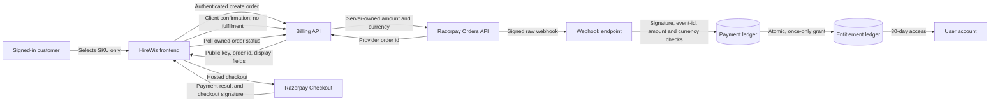

# HireWiz Payments Architecture

## Scope

The initial payment lane is for customers in India and charges in INR. The
first product is a one-time, non-renewing **HireWiz Premium — 30 days** pass.
Standalone analysis-unit packs are deliberately not offered until the chosen
payment provider approves that product model in writing.

Razorpay is the first provider adapter, but the order, event, and entitlement
records are provider-neutral. Checkout remains disabled until the Razorpay
account is approved, the owner signs off the go-live review, and an operator
explicitly enables it with complete live configuration.

## Trust boundaries

The browser is never trusted for price, currency, entitlement, payment status,
user identity, or provider selection. It submits only an allowlisted SKU and an
explicit `IN` billing-country confirmation; the server rejects every other
country for this initial lane. A valid browser checkout signature can be
recorded as a customer-facing confirmation signal, but only a verified webhook
may grant or revoke paid access.

## Catalog

The backend owns the purchasable catalog. Both public pricing and authenticated
checkout read the same catalog response.

Initial SKU:

| SKU | Price | Billing | Entitlement |
| --- | ---: | --- | --- |
| `premium_30d` | ₹999 INR | One-time; no automatic renewal | Premium access for 30 days |

Amounts are stored and compared in minor units (`99900` paise), never floating
point. The client submits `{"sku":"premium_30d","billing_country":"IN"}`;
neither amount nor currency is accepted from it.

Customer/product tax is a separate accounting field and remains unset until
the owner confirms the applicable tax and invoice treatment with an Indian CA.
Razorpay's Payment payload fields `fee` and `tax` are recorded explicitly as
the provider processing fee and the GST component of that fee; they are never
presented as tax charged to the customer.

`estimated_net_amount_minor` is only gross amount less the capture-time
provider fee. It is deliberately not called a settlement amount. Actual bank
credits, UTRs, holds and adjustments remain a dashboard/reconciliation task for
the controlled launch and require a separate settlement ledger before they are
automated.

## Order and event states

```mermaid
stateDiagram-v2
    [*] --> creating
    creating --> created: provider order stored
    creating --> provider_error: provider request fails
    created --> client_confirmed: valid checkout response
    created --> paid: verified captured-payment webhook
    client_confirmed --> paid: verified captured-payment webhook
    created --> created: payment attempt failed; same order remains retryable
    client_confirmed --> created: payment attempt failed; same order remains retryable
    paid --> refunded: full refund processed
    refunded --> [*]
```

Dispute/chargeback automation is not yet implemented. During the controlled
launch, disputes must be reconciled from the Razorpay dashboard and the paid
entitlement paused manually where appropriate; adding a dispute event adapter
and ledger transition is required before that process is automated.

Webhook delivery is expected to be duplicated and can arrive out of order.
Every provider event id is unique in the event ledger. Processing an already
seen event returns success without applying the entitlement again.

## Atomic fulfilment

For a captured payment, one database transaction must:

1. claim the provider event id;
2. lock or conditionally claim the local order;
3. verify provider order id, captured state, INR currency and exact amount;
4. record the provider payment id;
5. create the entitlement-ledger entry using a uniqueness constraint;
6. extend the user's Premium expiry; and
7. mark the order fulfilled.

If any step fails, the transaction is rolled back and no partial entitlement is
left behind. A browser return, redirect, query parameter, test key, missing
secret, or mock value can never invoke this path.

## Fail-closed activation

The adapter must have all required secrets and explicit operator approval flags
before it is exposed. When disabled:

- public pricing remains visible;
- the billing page explains that checkout is unavailable;
- no Razorpay script is loaded;
- no provider name is advertised as active; and
- order creation returns a service-unavailable response without creating a
  paid or mock entitlement.

Test and live credentials must never be mixed. Secrets belong in the deployment
secret manager/environment, not source control, frontend variables, logs,
support email, screenshots, or the underwriter packet.

## Refunds and account deletion

A full `refund.processed` webhook marks the order refunded and revokes the
entitlement attributable to that order. Access is recomputed from remaining
active entitlement-ledger entries; this avoids deleting access bought through a
different valid order.

Deleting a HireWiz account removes profile, resume, match, and other product
content. Payment records that must be retained for accounting, fraud,
chargeback, or legal obligations are unlinked or pseudonymised rather than
deleted. Raw webhook payloads and raw payment credentials are not retained.

## Adding another provider

A future provider adapter may create provider orders and validate its own
webhooks, but it must reuse the same catalog, local order states, event ledger,
entitlement service, refund handling, and tests. Provider-specific code must not
write directly to user access fields.
