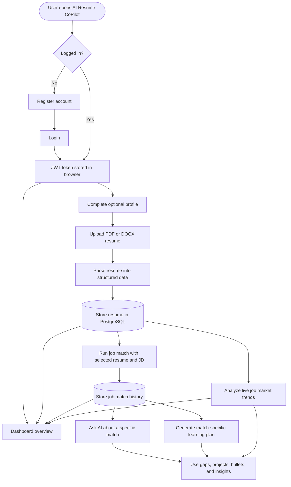
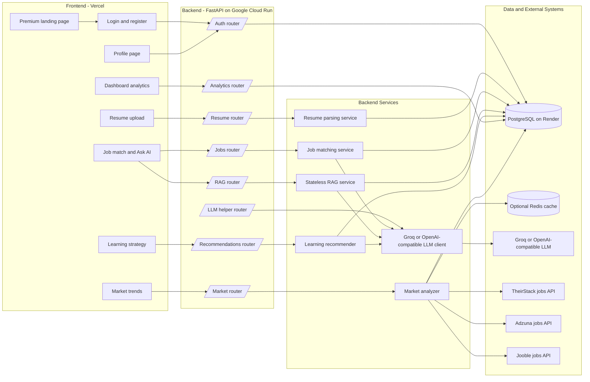
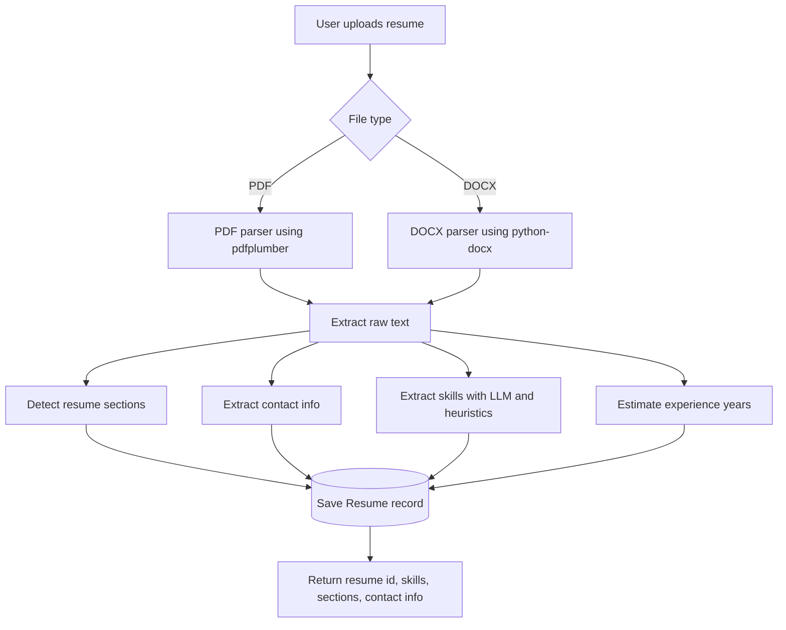
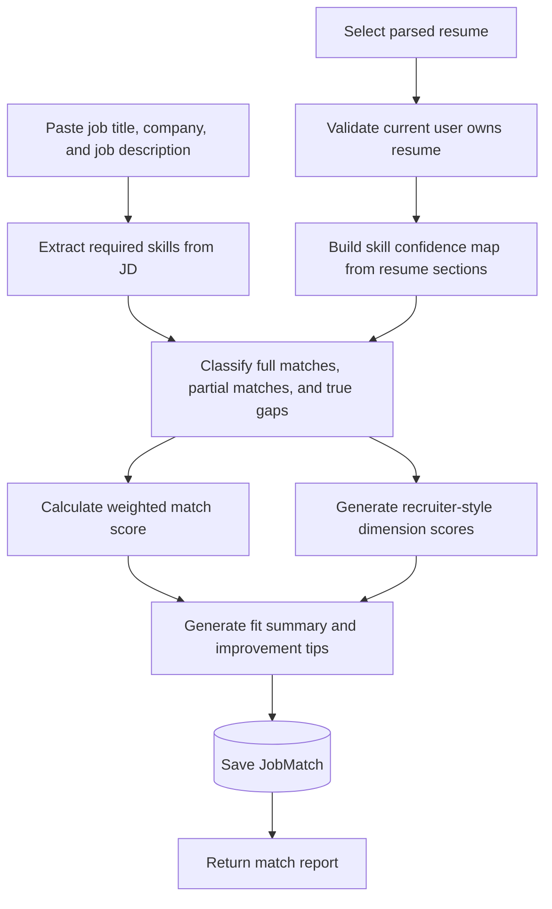
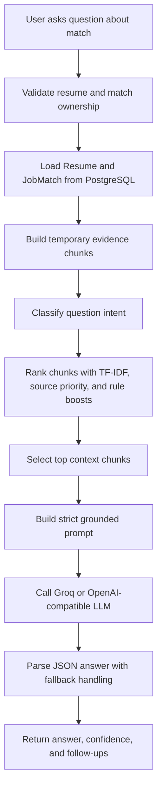
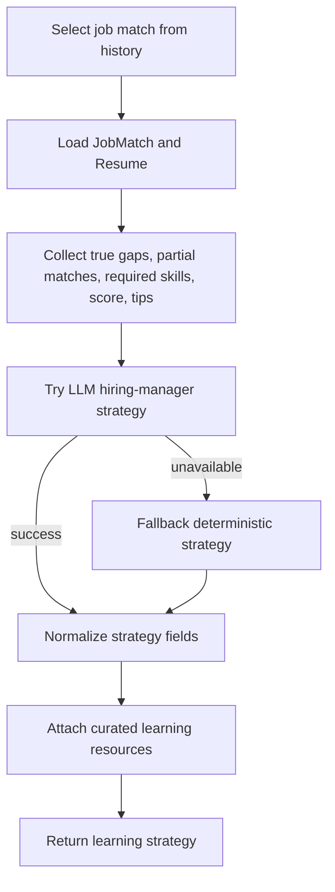
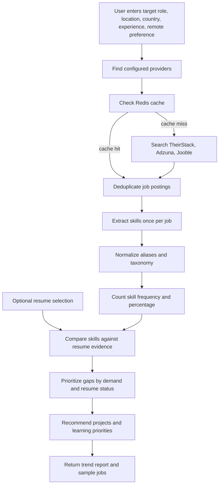
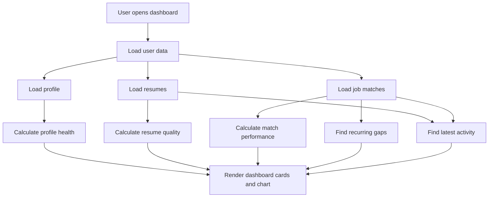
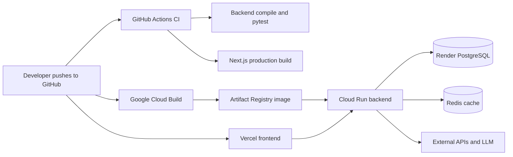

# AI Resume CoPilot Workflow

This document explains the complete product and technical workflow for AI Resume CoPilot. It is written as a GitHub-friendly Mermaid diagram document, so the diagrams render automatically on GitHub and in most Markdown preview tools.

For a visual browser version, open:

```text
docs/workflow.html
```

---

## 1. End-To-End Product Workflow



### What This Workflow Does

1. **Authentication:** The user registers or logs in. The frontend stores the JWT token and sends it with protected API calls.
2. **Profile Setup:** The user can optionally add profile context such as target role, location, links, skills, education, and career preferences.
3. **Resume Parsing:** The user uploads a PDF or DOCX resume. The backend extracts text, sections, contact info, skills, and estimated experience.
4. **Job Matching:** The user selects a parsed resume and pastes a job description. The backend creates a detailed match analysis and stores the result.
5. **Ask AI:** The user can ask grounded questions about a specific resume and job match. The app does not store chat history.
6. **Learning Strategy:** The user selects a match from history and gets a gap-focused learning plan with projects, resume bullets, and interview talking points.
7. **Market Trends:** The user searches live job market data for a target role and compares repeated market skills with their resume.
8. **Dashboard:** The dashboard summarizes profile health, resume quality, match performance, activity, and recurring gaps.

---

## 2. System Architecture Workflow



### Architecture Responsibilities

| Layer | Responsibility |
| --- | --- |
| Frontend | Product UI, auth state, form flows, dashboards, charts, and API calls. |
| FastAPI routers | API boundary for auth, profile, resume, jobs, RAG, recommendations, market, LLM helpers, and analytics. |
| Services | Business logic for parsing, matching, RAG retrieval, learning plans, and market analysis. |
| PostgreSQL | Persistent user, profile, resume, job match, and skill coverage data. |
| Redis | Optional cache for repeated market provider responses. |
| LLM | Generates fit summaries, learning plans, grounded answers, bullets, and interview questions. |
| Job providers | Live job-market source data for trend analysis. |

---

## 3. Resume Parsing Workflow



### Resume Parsing Functionality

- Accepts PDF and DOCX uploads.
- Extracts raw text from the file.
- Detects sections such as experience, projects, education, skills, certifications, and other resume blocks.
- Extracts contact fields such as name, email, phone, LinkedIn, and GitHub.
- Extracts skills using LLM support when available, with heuristic fallback.
- Estimates years of experience from date ranges.
- Stores parsed resume data against the logged-in user.

---

## 4. Job Match Intelligence Workflow



### Job Match Functionality

- Verifies that the selected resume belongs to the current user.
- Extracts required and preferred skills from the job description.
- Compares job requirements against resume skills and resume evidence.
- Separates skills into:
  - full matches
  - partial matches
  - true gaps
- Produces:
  - match score
  - grade
  - skill verification rate
  - recruiter-style dimension scores
  - fit summary
  - improvement tips
- Persists the match so it can be used by the dashboard, Ask AI, and learning recommendations.

---

## 5. Stateless Ask AI Workflow



### Ask AI Functionality

- Works for a specific resume and job match.
- Builds temporary context from up to 15 evidence sources:
  - resume summary
  - resume skills
  - experience
  - projects
  - education
  - other resume sections
  - job description
  - required skills
  - full matches
  - partial matches
  - true gaps
  - match score
  - dimension scores
  - fit summary
  - improvement tips
- Classifies questions into 7 intent groups:
  - missing skills
  - score explanation
  - evidence or proof
  - interview prep
  - learning path
  - resume improvement
  - general
- Retrieves top context chunks with TF-IDF similarity plus rule-based boosts.
- Sends only selected context to the LLM.
- Returns JSON containing:
  - answer
  - confidence
  - suggested follow-up questions
- Does not store:
  - chat history
  - chunks
  - embeddings
  - vector indexes

---

## 6. Learning Recommendation Workflow



### Learning Functionality

- Uses a saved job match as the source of truth.
- Generates recommendations for the exact job the user analyzed.
- Produces:
  - readiness summary
  - missing hiring signals
  - learning priorities
  - project recommendations
  - implementation steps
  - resume bullets
  - interview talking points
  - timeline
- Adds curated learning resources where available.
- Falls back to deterministic strategy generation if the LLM fails.

---

## 7. Market Skill Trend Analyzer Workflow



### Market Analyzer Functionality

- Searches live job postings from configured providers.
- Supports fallback across 3 providers:
  - TheirStack
  - Adzuna
  - Jooble
- Uses Redis cache when available.
- Deduplicates jobs before analysis.
- Extracts skills from each job description.
- Counts a skill at most once per job.
- Uses a taxonomy with:
  - 14 skill categories
  - 132 canonical skills
  - 40 aliases
- Calculates skill demand percentages.
- Compares market skills with the user's resume and marks each as:
  - proven
  - claimed
  - missing
- Prioritizes gaps as:
  - critical
  - high
  - medium
  - low
- Generates project ideas and resume bullets to close high-value gaps.

---

## 8. Dashboard Analytics Workflow



### Dashboard Functionality

- Shows profile completeness.
- Shows average match score.
- Shows resume count and match count.
- Shows last activity.
- Summarizes resume quality:
  - unique skills
  - evidenced skills
  - claimed-only skills
  - verification rate
  - quantified achievements
  - missing sections
- Summarizes match performance:
  - best match
  - weakest match
  - latest match
  - score trend chart
- Shows recurring skill gaps.
- Provides quick actions to update profile, upload resume, run match, and generate learning strategy.

---

## 9. Deployment Workflow



### Deployment Functionality

- GitHub Actions verifies backend and frontend changes.
- Cloud Build can build and deploy the backend container.
- Cloud Run hosts the FastAPI backend.
- Vercel hosts the Next.js frontend.
- Render PostgreSQL stores application data.
- Redis is optional and used for provider response caching.
- Groq and job-provider APIs are called from the backend.

---

## 10. Feature-To-Route Map

| Feature | Frontend Page | Backend Route | Core Service |
| --- | --- | --- | --- |
| Register/Login | `/register`, `/login` | `/api/auth/register`, `/api/auth/login` | `security.py` |
| Profile | `/profile` | `/api/auth/profile` | auth router |
| Resume upload | `/resume` | `/api/resume/parse` | `services/parsing.py` |
| Resume list | `/resume`, `/jobs`, `/market` | `/api/resume/list` | resume router |
| Job match | `/jobs` | `/api/jobs/match` | `services/matching.py` |
| Match history | `/jobs`, `/learning` | `/api/jobs/matches` | jobs router |
| Ask AI | `/jobs` | `/api/rag/ask` | `services/rag/*` |
| Learning strategy | `/learning` | `/api/recommendations/match_strategy` | `services/recommender.py`, `llm_client.py` |
| Market trends | `/market` | `/api/market/analyze` | `services/market/*` |
| Dashboard | `/dashboard` | `/api/analytics/summary` | analytics router |
| Bullet rewrite | API utility | `/api/llm/rewrite_bullets` | `services/llm_client.py` |
| Interview questions | API utility | `/api/llm/interview_questions` | `services/llm_client.py` |

---

## 11. Quantifiable System Summary

| Metric | Current Value |
| --- | ---: |
| Backend API endpoints | 16 |
| Frontend routes/pages | 10 |
| SQLAlchemy database models | 5 |
| Pydantic schemas | 38 |
| Backend Python source files | 38 |
| Frontend TypeScript/TSX files | 17 |
| Market providers | 3 |
| Market skill categories | 14 |
| Canonical market skills | 132 |
| Skill aliases | 40 |
| Ask AI evidence chunk sources | 15 |
| Ask AI intent categories | 7 |
| Project recommendation templates | 5 |
| Deployment/CI config files | 6 |

---

## 12. High-Level Value

AI Resume CoPilot turns a resume into a connected career intelligence workflow:

1. **Understand the candidate:** profile and resume parsing.
2. **Understand the job:** skill extraction and match scoring.
3. **Explain the gap:** full/partial/gap classification and Ask AI.
4. **Improve the candidate:** learning plans and project recommendations.
5. **Track the market:** live job trend analysis.
6. **Track progress:** dashboard analytics and match history.

